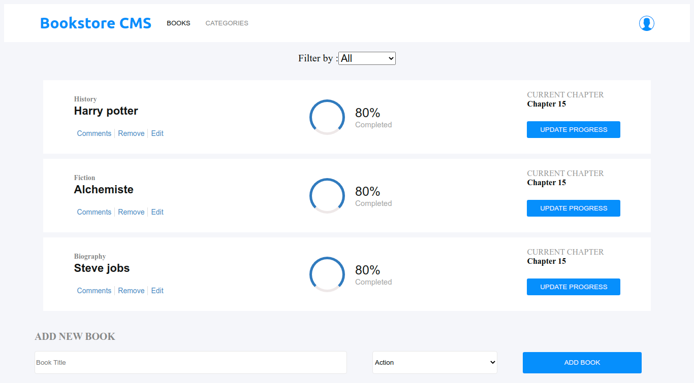

# Book Store - A web application for managing Book store.

>A Book store management app built on the React library.

## Table of Contents

- [Features](#features)
- [Built With](#built-with)
- [Live Demo](#live-demo)
- [Getting Started](#getting-started)
  - [Installation](#installation)
  - [Usage](#usage)
- [Authors](#authors)

## Features



- Allows user to organize and manage the Bookstore.

## Built With

- Node.js
- React
- React-DOM
- React-Create-App
- Redux
- npm
- CSS
- ES6

## Live Demo

[Live Demo Link](https://rb-book-store.herokuapp.com/)

## Getting Started

To get a local copy up and running follow these simple example steps.

<!-- ### Prerequisites -->

<!-- ### Setup -->

### Installation

Clone the repo with:

```sh
git clone https://github.com/bouaik/Book_store
```

### Usage

1. Run `npm install` to install all dependencies

2. Run `npm start` to start the local server

<!-- ## Roadmap -->

<!-- ### Deployment -->

### Authors

👤 **Ramesh Naidu Allu**

- Github: [@rna](https://github.com/rna)
- Twitter: [@rnadev](https://twitter.com/rnadev)
- Linkedin: [Linkedin](https://linkedin.com/in/ramesh-naidu)

👤 **Bouaik Lhoussaine**

- Github: [@bouaik](https://github.com/bouaik)
- Twitter: [@LhoussaineBoua1](https://twitter.com/LhoussaineBoua1)
- Linkedin: [Linkedin](https://linkedin.com/in/lhoussainebouaik)

## 🤝 Contributing

Contributions, issues and feature requests are welcome!

Feel free to check the [issues page](issues/).

## Show your support

Give a ⭐️ if you like this project!

<!-- ## Acknowledgments -->

## 📝 License

This project is [MIT](lic.url) licensed.